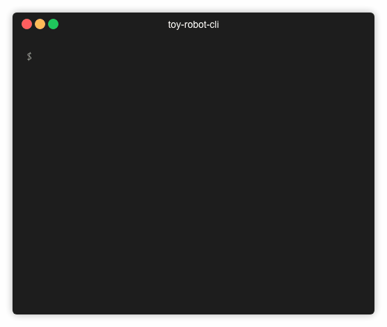

<div align="center">
<h1>toy-robot-cli</h1>

A CLI exploration with `react`, `pastel` and `ink` libraries



</div>

<hr />

## Table of Contents

<!-- START doctoc generated TOC please keep comment here to allow auto update -->
<!-- DON'T EDIT THIS SECTION, INSTEAD RE-RUN doctoc TO UPDATE -->


- [Overview](#overview)
- [Functional Stories](#functional-stories)
- [CLI](#cli)
- [Development](#development)
- [Tools](#tools)
- [Caveats](#caveats)

<!-- END doctoc generated TOC please keep comment here to allow auto update -->

## Overview

This project demonstrates usage of React and shared logic in React custom hook in `core/useBoardReducer.js` to create a command line interface application.

`commands/index.js` is the entry point of this application, as bootstrapped with `parcel`

`components` folder contains application implementation that is specific to command line interface.

`core` folder contains code pieces that are render target agnostic, i.e. could be used with Ink, ReactDOM, React Native, to create application of the same functionality set.

Refer to [Tools](#tools) for the overview of the application stack.

## Functional Stories

User assigns width and height of the table where the toy robot will be placed (`SizeScreen.js`).

User assigns position (x, y) and facing direction of the toy robot on the table (`PlacementScreen.js`).

User uses keyboard up and down to navigate and select action for the toy robot, i.e. move, rotate left, rotate right (`PlaySelectScreen.js`).

User switches to keyboard mode and use keyboard keys to achieve the same actions above (`PlayKeyboardScreen.js`).

Input validations are also in place.

## CLI

As this CLI package is not published to npm, running it locally requires triggering of `yarn dev` to start the compilation, which will link the executable to your path.

After that, on a separate terminal session, you could run `toy-robot-cli` command.

```
$ toy-robot-cli --help
toy-robot-cli

Toy Robot Command Line Application

Options:

  --default  Run the application with default values   [boolean]
```

## Development

There are 2 available commands:

- `yarn dev` - Start development mode and recompile on change
- `yarn build` - Build a final distributable for npm

## Tools

Core stack includes:

- [React](https://reactjs.org) - Declarative UI library
- [Ink](https://github.com/vadimdemedes/ink) - React for interactive command-line apps
- [Pastel](https://github.com/vadimdemedes/pastel) - Framework for effortlessly building Ink apps
- [Final Form](https://github.com/final-form/react-final-form) - High performance subscription-based form state management for React
- [Jest](https://jestjs.io/) - Delightful JavaScript Testing

## Caveats

- [`ink-testing-library`](https://github.com/vadimdemedes/ink-testing-library/issues/3) has yet to implement `act` to flush React `useEffect` instances. Hence, the tests do not currently cover assertions for the effects in `ink`.
- [`ink-testing-library`](https://github.com/vadimdemedes/ink-testing-library/pull/7) has yet to enable raw mode for capturing keyboard input in test. `patch-package` is used to implement the change in the pending pull request for this.
